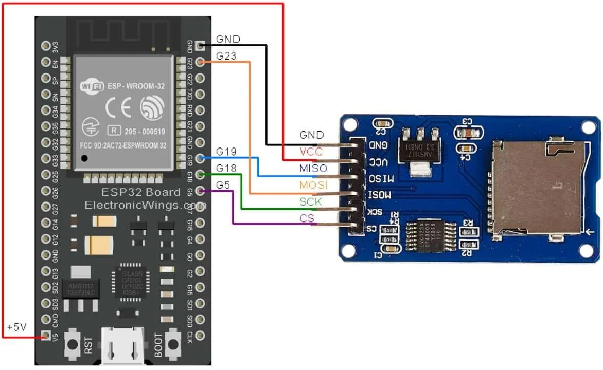

# Servidor Web com Esp32

Este projeto implementa um servidor web utilizando o **ESP32** e o modulo **MicroSD Card Adapter** para servir uma pagina **HTML**, estilzada com **Bootstrap** e **Javascript**, através da rede local.

<p align="center">
   
   
   
   
</p>


## Configuração do Ambiente

###### Requisitos
- VSCode
- PlatformIO
- Placa Esp32
- Cartão SD
- MicroSD Card Adapter (Modulo)

#### Lista de Componentes

<table>
   <thead>
      <th>Componente</th>
      <th>Quantidade</th>
   </thead>
   <tbody>
      <tr>
         <td>Esp32</td>
         <td>1</td>
      </tr>
      <tr>
         <td>MicroSD Card Adapter</td>
         <td>1</td>
      </tr>
      <tr>
         <td>Cartão SD</td>
         <td>1</td>
      </tr>
      <tr>
         <td>Cabo USB</td>
         <td>1</td>
      </tr>
      <tr>
         <td>Jumpers</td>
         <td>6</td>
      </tr>
   </tbody>
</table>


### Instalação e Configuração

1. Faça a instalação do **VSCode**, depois busque e instale a extensão do **PlatformIO**.

2. Formate o cartão SD como **FAT16**, **FAT32** ou **exFAT**.

3. Clone o repositório para sua máquina local:

```
git clone https://github.com/aasjunior/esp32_web_server.git
```
4. Salve o diretório `site` no cartão SD e depois o coloque no slot do **MicroSD Card Adapter**

5. Abra o diretório `web_server` utilizando o **PlatformIO**.

6. Verifique se todas as dependências estão instaladas conforme especificado no `platformio.ini`.

7. Configure o nome e a senha da rede **WiFi** no arquivo `Credentials.h`.

8. Faça as conexões entre o **Esp32** e o modulo MicroSD como especificado abaixo:

<div align='center'>
    
</div>

### Como Usar

1. Compile e carregue o código para o **ESP32** utilizando o **PlatformIO**.

2. Abra o **monitor serial** para verificar a saída e o endereço **IP** atribuído.

3. Conecte-se na mesma rede **WiFi** do **ESP32**.

4. Acesse o servidor web através do endereço **IP** exibido para acessar a página web salva no cartão SD.

### Observações

- Certifique-se de que seu adaptador MicroSD esteja devidamente conectado ao **ESP32** para que o cartão SD seja inicializado corretamente.

<br>

## Componentes do Projeto

#### Estrutura de Arquivos

```
📁 web_server/ 
├── 📁 include/
|    ├── 📄 Enums.h
|    ├── 📄 Credentials.h
|    ├── 📄 SDManager.h
|    ├── 📄 WebServerManager.h
|    └── 📄 WiFiManager.h
├── 📁 src/  
|    ├── 📁 core/
|    |    ├── 📄 SDManager.cpp
|    |    ├── 📄 WebServerManager.cpp
|    |    └── 📄 WiFiManager.cpp
|    └── 📄 main.cpp
└── 📄 platformio.ini
```

<br>

- 📁 **include/**: Este diretório possui os arquivos de cabeçalho (`.h`) que definem as **interfaces** das classes de funções utilizadas no projeto.
   
    - **Enums.h**: Define as enumerações (`WiFiStatus` e `SDStatus`) utilizadas para representar o status da conexão WiFi e do cartão SD.
    
    ```c++
    #ifndef ENUMS_H
    #define ENUMS_H

    enum WiFiStatus{
        WIFI_CONNECTING,
        WIFI_CONNECTED, 
        WIFI_FAILED
    };

    enum SDStatus{
        SD_INITIALIZED,
        SD_FAILED,
        SD_NO_CARD
    };

    #endif
    ```

    <br>

    - **Credentials.h**: Contém as credenciais de rede WiFi (`SSID` e senha), mantidas separadamente para fins de segurança. 
    
    ```c++
    const char* ssid = "WIFI_SSID";
    const char* password = "WIFI_PASSWORD";
    ```
    
    <br>

    - **SDManager.h**: Declara a classe `SDManager`, responsável pelo gerenciamento do cartão SD.

    ```c++
    #ifndef SD_MANAGER_H
    #define SD_MANAGER_H

    #include <SD.h>
    #include "Enums.h"

    class SDManager{
    public:
        SDManager(int pinCS);
        SDStatus begin();
        void listDir(fs::FS &fs, const char * dirname, uint8_t levels);

    private:
        int pinCS;
    };

    #endif
    ```

    <br>

    - **WebServerManager.h**: Declara a classe `WebServerManager`, responsável pela configuração e execução do servidor web.

    ```c++
    #ifndef WEB_SERVER_MANAGER_H
    #define WEB_SERVER_MANAGER_H

    #include <ESPAsyncWebServer.h>
    #include <SD.h>

    class WebServerManager{
    public:
        WebServerManager();
        void begin();

    private:
        AsyncWebServer server;
    };

    #endif
    ```

    <br>

    - **WiFiManager.h**: Declara a classe `WiFiManager`, responsável pelo gerenciamento da conexão WiFi.

    ```c++
    #ifndef WIFI_MANAGER_H
    #define WIFI_MANAGER_H

    #include <WiFi.h>
    #include "Enums.h"

    class WiFiManager{
    public:
        WiFiManager(const char* ssid, const char* password);
        WiFiStatus connect();
        IPAddress getIP();

    private:
        const char* ssid;
        const char* password;
    };

    #endif
    ```

<br>
<br>

- 📁 **src/core**: Este diretório os arquivos de implementação (`.cpp`) das classes definidas nos arquivos de cabeçalho.

    - **SDManager.cpp**: Implementa os métodos da classe `SDManager` declarados em `SDManager.h`, como `begin()` e `listDir()`.

    - **WebServerManager.cpp**: Implementa os métodos da classe `WebServerManager` declarados em `WebServerManager.h`, como `begin()` para iniciar o servidor web.

    - **WiFiManager.cpp**: Implementa os métodos da classe `WiFiManager` declarados em `WiFiManager.h`, como `connect()` para conectar-se à rede WiFi e `getIP()` para obter o endereço **IP**.


- **main.cpp**: Arquivo principal do programa, que contém a função `setup()` e `loop()` (não utilizada no exemplo) do **ESP32**, onde as instâncias das classes são criadas e utilizadas para inicializar o **WiFi**, o **cartão SD** e o **servidor web**.

- **platformio.ini**: Arquivo de configuração do **PlatformIO** que define as opções de compilação, upload e configuração de bibliotecas utilizadas no projeto.

```
[env:esp32dev]
platform = espressif32
board = esp32dev
framework = arduino
monitor_speed = 115200
lib_deps =
    SPI
    SD
    ESP Async WebServer
    AsyncTCP
    WiFi
```

##
##### Aviso

Este é um projeto utilizado para fins acadêmicos e aprendizado com a placa de desenvolvimento **Esp32** e linguagem de programação **C++**.